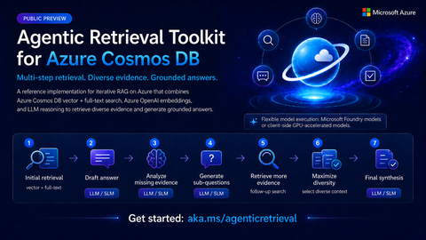
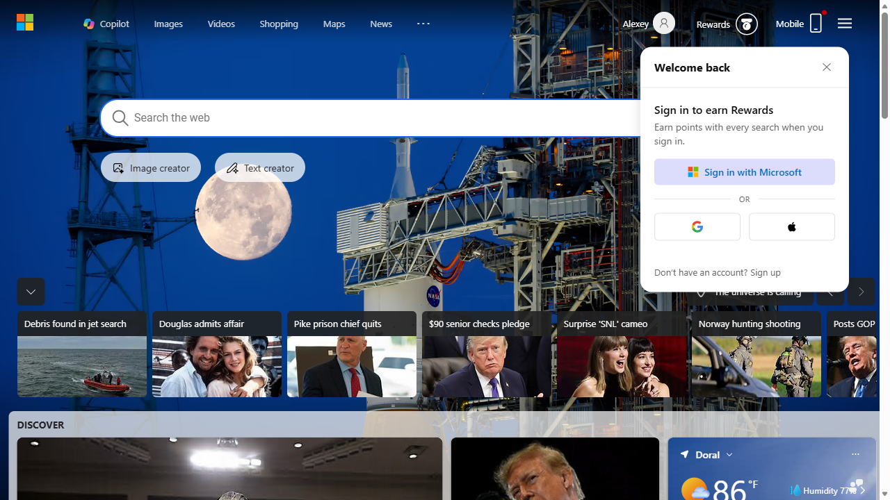
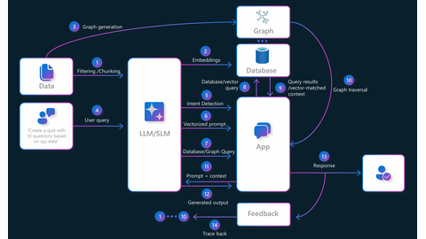
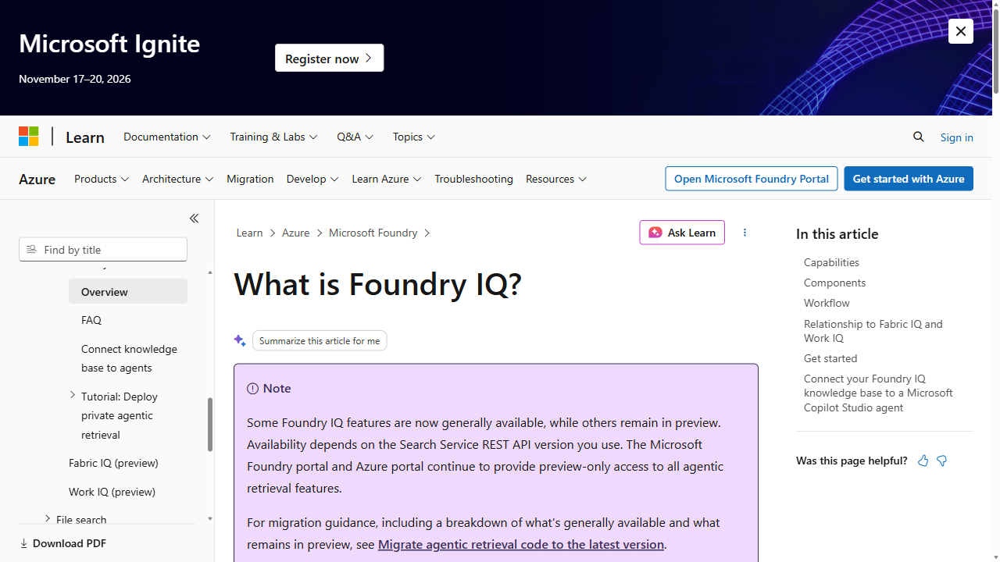
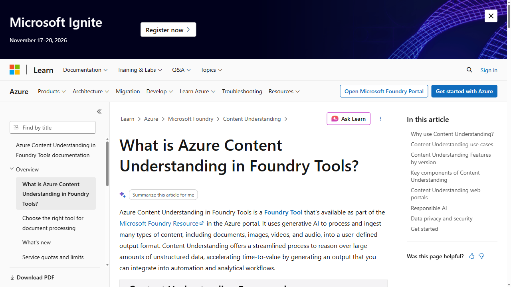
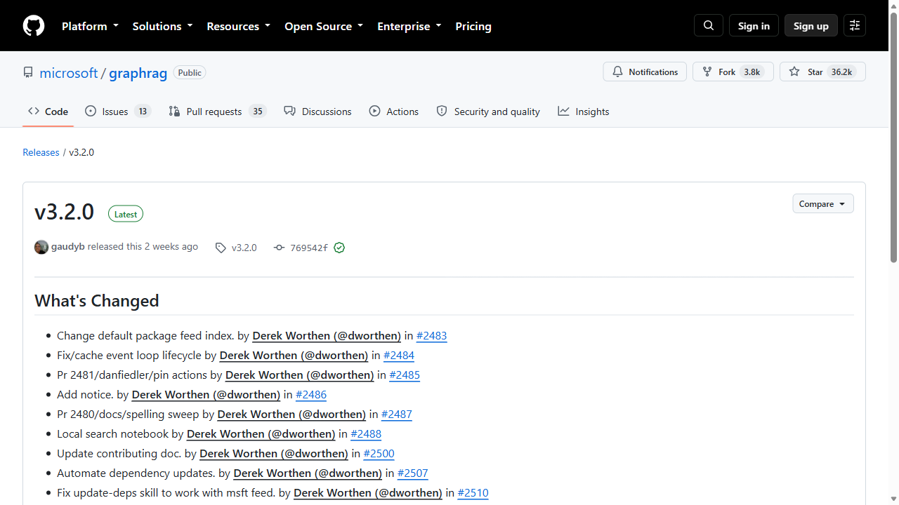
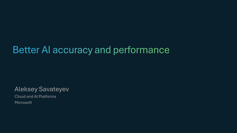
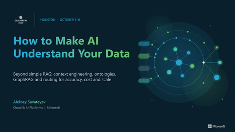

# Context Engineering Best Practices

A curated set of resources for building AI systems with better retrieval, memory, grounding, and understanding of enterprise content.

## 1. Agentic Retrieval powered by DiverseRAG

**[Open Agentic Retrieval](https://aka.ms/agenticretrieval)** — A multi-stage, self-correcting retrieval accelerator built with Azure Cosmos DB and Microsoft Foundry. It decomposes complex questions, identifies knowledge gaps, retrieves targeted evidence while maximizing context diversity, and synthesizes grounded answers.

## 2. Agentic Memory powered by Azure Cosmos DB

**[Open Agent Memory Toolkit](https://github.com/AzureCosmosDB/AgentMemoryToolkit)** — A Python SDK for storing, retrieving, and transforming agent memories in Azure Cosmos DB. It supports raw conversation history, thread summaries, extracted facts, procedural and episodic memories, and cross-thread user profiles.

## 3. CosmosAIGraph powered by OmniRAG

**[Open CosmosAIGraph](https://aka.ms/caig)** — An implementation of the OmniRAG pattern using Azure Cosmos DB vector and hybrid search with an Apache Jena in-memory knowledge graph. It routes user queries based on the detected intent across multiple data sources to assemble comprehensive context. It also could be used for traditional graph use cases while using Cosmos DB as a primary persistent store.  

## 4. Foundry IQ

**[Open the Foundry IQ overview](https://learn.microsoft.com/en-us/azure/foundry/agents/concepts/what-is-foundry-iq)** — A managed, permission-aware knowledge layer for AI agents. Foundry IQ connects reusable knowledge bases to enterprise sources and uses agentic retrieval to return grounded answers with citations.

## 5. Azure Content Understanding for extracting structure from unstructured data

**[Open the Azure Content Understanding overview](https://learn.microsoft.com/en-us/azure/ai-services/content-understanding/overview)** — A Foundry tool that uses generative AI to process documents, images, video, and audio into user-defined structured output for automation and analytics.

## 6. GraphRAG - comprehensive RAG over structured and unstructured data

**[Open the latest GraphRAG release (v3.2.0)](https://github.com/microsoft/graphrag/releases/tag/v3.2.0)** — The latest release of original Microsoft's modular graph-based retrieval-augmented generation system, published September 24, 2026. Please note, the latest release of GraphRAG (faster/cheaper/more scalable) is not open-sourced, but is included in Microsoft Discovery App (free): *[Microsoft Discovery](https://learn.microsoft.com/en-us/azure/microsoft-discovery/concept-discovery-and-discovery-app)*

## 7. Better AI Accuracy and Performance

**[Open the Better AI Accuracy and Performance deck](decks/Better%20AI%20accuracy%20and%20performance.pdf)** — A 33-slide presentation covering practical approaches for improving the accuracy and performance of AI solutions.

## 8. How to Make AI Understand Your Data

**[Open the Oil & Gas AI 2026 conference deck](decks/How%20to%20Make%20AI%20Understand%20Your%20Data%20-%20Oil%20%26%20Gas%20AI%202026.pdf)** — A 16-slide presentation on moving beyond simple RAG with context engineering, ontologies, GraphRAG, and intelligent routing for better accuracy, cost, and scale.

---

Project and documentation thumbnails updated October 4, 2026.
